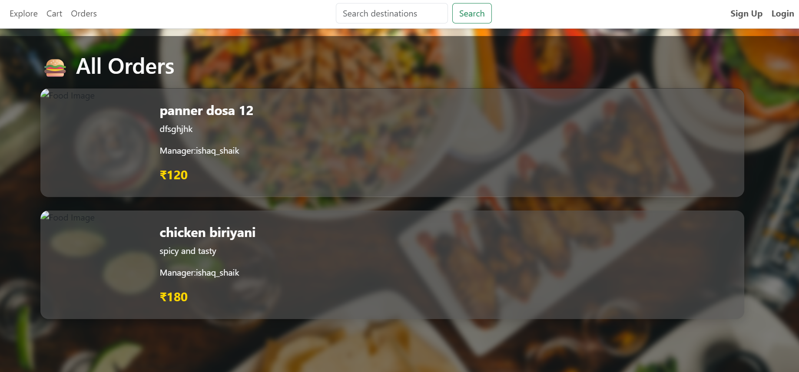
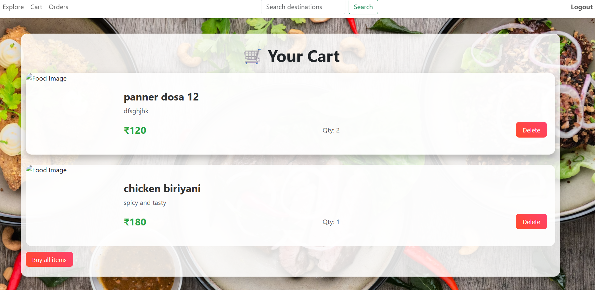
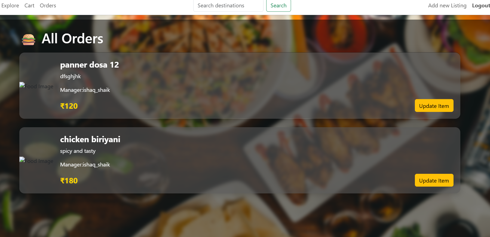

# 🍴 Canteen Food Management System



A full-stack **Canteen Food Management System** built to streamline food ordering and management in a canteen.  

The system supports two types of users:  

- **Admin** 👨‍💻 – manages menu items, monitors orders, and handles user management.  
- **User** 👤 – browses the menu, places orders, and tracks their status.  

---

## 🚀 Features


### For Users

- Register and login securely.
- Browse available food items.
- Place orders and track their status.
- Receive order notifications via email.

### For Admins

- Add, update, or delete food items.
- Manage incoming orders.
- Monitor user activities.
- Secure admin dashboard.

---

## 📦 Installation & Usage
```bash
# 1. Clone the repository
git clone https://github.com/abhishekkumareddy/canteen-food-management.git
cd canteen-food-management

# 2. Install backend dependencies
npm install

# 3. Create a .env file in the root directory and add:
# (use your own values for security)
# MONGO_URI="your_mongo_connection_uri"
# JWT_SECRET="your_secret_key"
# EMAIL_USER="your_email@example.com"
# EMAIL_PASS="your_app_password"

# 4. Run the backend server
npm start

# 5. Run the frontend (if it exists in /client folder)
cd client
npm install
npm start

## folder structure
canteen-food-management/
│── backend/
│   ├── models/        # MongoDB schemas
│   ├── routes/        # Express routes
│   ├── controllers/   # Request handlers
│   └── server.js      # Entry point
│
│── frontend/          # React app (if separate)
│── .env               # Environment variables
│── package.json
└── README.md

# 🔐 Security Notes
- Do not commit `.env` to version control.  
- Use strong JWT secrets.  
- Use environment-specific email credentials (with App Passwords).  
- Keep production credentials secure and separate from development ones.  

---

# 📌 Future Enhancements
- Online payment gateway integration.  
- Real-time order tracking system.  
- Admin analytics dashboard with charts.  
- Push notifications for order updates.  

---

# 👨‍💻 Author
**Abishek Kumar Reddy**  
📌 GitHub: [abhishekkumareddy](https://github.com/abhishekkumareddy)  

---
